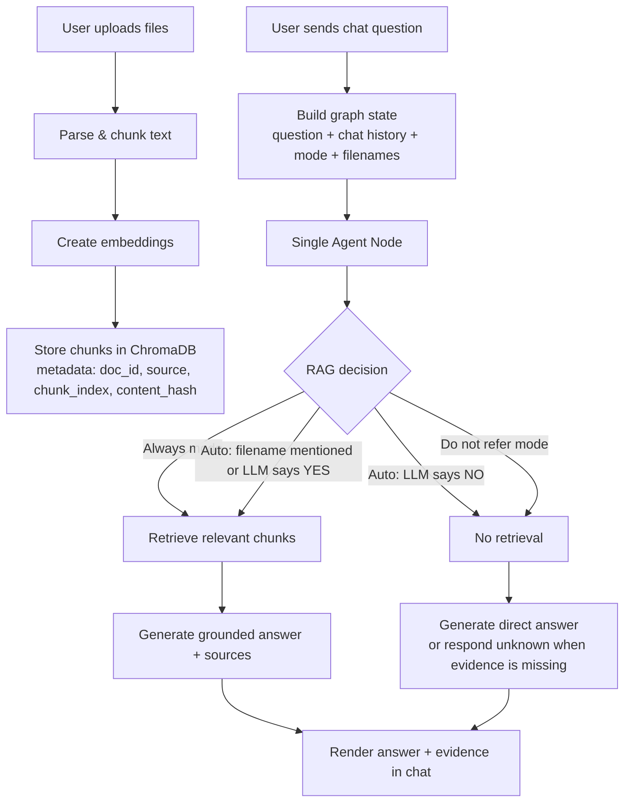

# Document RAG Chat Assistant

A Streamlit-based RAG app using OpenAI, LangChain, LangGraph, and ChromaDB.

## Features
- Upload documents (`.txt`, `.md`, `.csv`, `.pdf`, `.docx`).
- Ingest documents into persistent ChromaDB (`./chroma_db`).
- Content-hash deduplication on ingest (same file content is skipped).
- Chat UI with `st.chat_input` and in-session chat history.
- Editable system prompt from sidebar.
- Single-agent decision flow (LangGraph node) with RAG modes:
  - `Auto decide`
  - `Always refer documents`
  - `Do not refer documents`
- Evidence display: shows retrieved chunks used for each answer.
- Document management: list indexed docs and delete selected doc from vector DB.
- Uploader auto-clear after successful ingest.

## Tech Stack
- OpenAI API (`ChatOpenAI`, `OpenAIEmbeddings`)
- LangChain
- LangGraph
- Streamlit
- ChromaDB
- `python-dotenv`

## Setup
1. Create and activate a virtual environment:
   ```bash
   python -m venv .venv
   source .venv/bin/activate
   ```
2. Install dependencies:
   ```bash
   python -m pip install -r requirements.txt
   ```
3. Create/update `.env` in project root:
   ```env
   OPENAI_API_KEY=your_key_here
   ```

## Environment Setup
This app reads environment variables from `.env` using `python-dotenv`.

1. Create `.env` in the project root (`RAG/.env`).
2. Add your OpenAI key:
   ```env
   OPENAI_API_KEY=your_key_here
   ```
3. Do not wrap the key in extra quotes unless needed.
4. Keep `.env` private (already ignored by `.gitignore`).

Optional quick check after activating venv:
```bash
python -c "from dotenv import load_dotenv; load_dotenv('.env'); import os; print(bool(os.getenv('OPENAI_API_KEY')))"
```
It should print `True`.

## Run
```bash
source .venv/bin/activate
python -m streamlit run app.py
```

Open the local URL shown by Streamlit (usually `http://localhost:8501`).

## How To Use
1. In sidebar, upload one or more documents.
2. Click `Ingest Uploaded Files`.
3. Choose `RAG Mode`:
   - `Auto decide`: agent decides if retrieval is needed.
   - `Always refer documents`: always retrieve from docs.
   - `Do not refer documents`: no retrieval; answers only from non-doc context.
4. Ask questions in chat input.
5. Expand `Retrieved Chunks (Evidence)` under assistant responses to inspect grounding.
6. Delete documents from sidebar when needed.

## File Structure
```text
RAG/
├── app.py              # Streamlit UI + LangGraph single-agent flow + ingestion/retrieval logic
├── requirements.txt    # Python dependencies
├── .env                # OpenAI API key (local, ignored)
├── .gitignore
├── chroma_db/          # Persistent Chroma vector store
└── README.md
```

## Architecture

### High-level flow


### Agent decisions
- If question asks which docs/files are uploaded: answer deterministically from indexed filenames.
- If mode is `Always refer documents`: use retrieval.
- If mode is `Do not refer documents`: skip retrieval.
- If mode is `Auto decide`:
  - force retrieval if user mentions a known filename,
  - otherwise use LLM yes/no decision for retrieval.

## Notes
- Chroma data persists in `./chroma_db`.
- Deletion removes all chunks for a selected document via `doc_id` metadata.
- Duplicate content is skipped using SHA-256 content hash.
